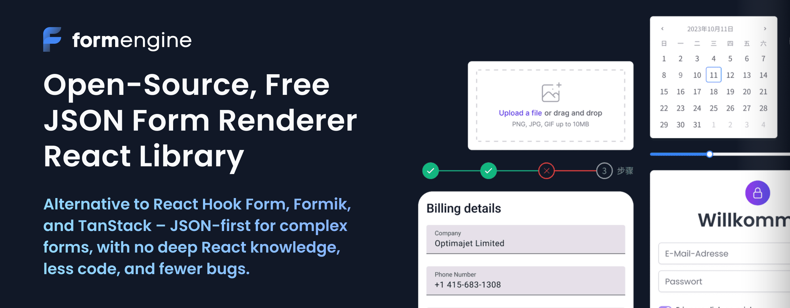
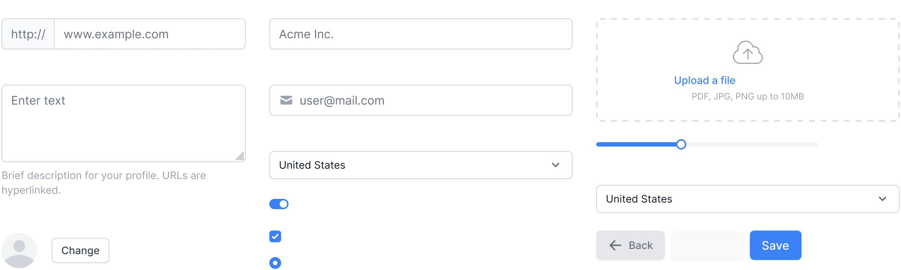
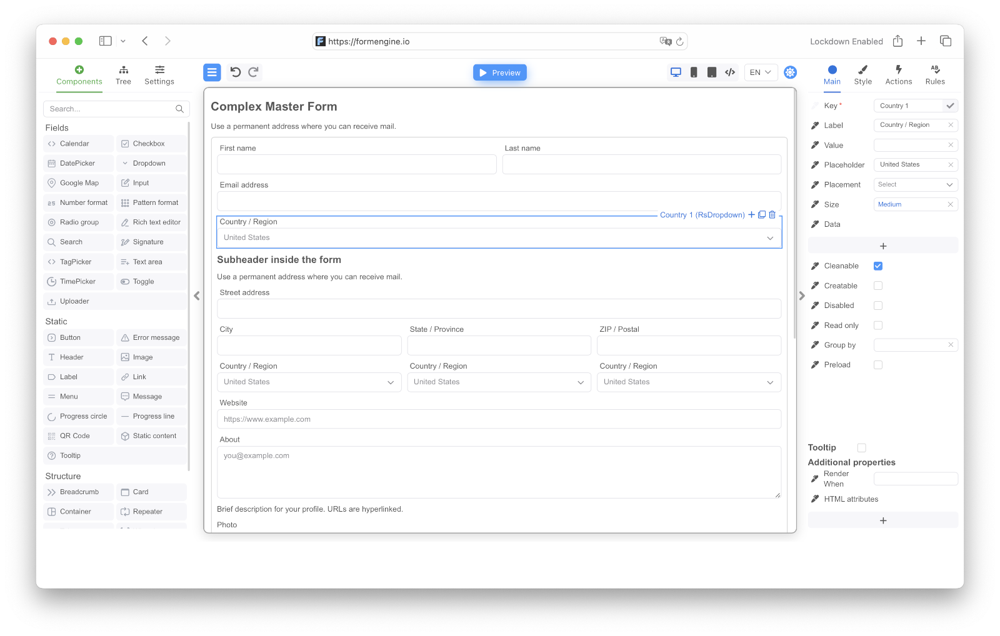

[](https://formengine.io)
<!-- ==================== FORMENGINE CORE BADGES ==================== -->
[](https://www.npmjs.com/package/@react-form-builder/core)
[](https://www.npmjs.com/package/@react-form-builder/core)
[](https://github.com/optimajet/formengine/blob/master/LICENSE)
[](https://github.com/optimajet/formengine/issues)
[](https://github.com/optimajet/formengine/issues?q=is%3Aissue+is%3Aclosed)
<!-- ================================================================ -->
### Struggled with React Hook Form, Formik, or TanStack Form? You’re not alone. 

### Forms shouldn’t be this hard! That’s why we built Formengine Core — a JSON-first React Form Renderer and open-source form engine for React. It’s time to use something better. Describe your form in JSON and render it across your apps. No hooks. No context. No boilerplate. No pain.

### 📦 Formengine Core Installation  
Install the core package and RSuite free form components:  
 ```bash  
 npm install @react-form-builder/core @react-form-builder/components-rsuite  
 ```  
## 🚀 Formengine Quick Start Example

Here's a minimal example of a **React Form Engine Core** form using RSuite components:

```tsx
import { viewWithCss } from '@react-form-builder/components-rsuite'
import { buildForm, FormViewer } from '@react-form-builder/core'

const simpleForm = buildForm({ errorType: 'RsErrorMessage' })
  .component('container', 'RsContainer')
  .style({ flexDirection: 'row' })
  .children((builder) =>
    builder
      .component('firstName', 'RsInput')
      .prop('placeholder', 'Enter your first name')
      .prop('label', 'First Name')
      .validation('required')

      .component('lastName', 'RsInput')
      .prop('placeholder', 'Enter your last name')
      .prop('label', 'Last Name')
      .validation('required')
  )

  .component('birthDate', 'RsDatePicker')
  .prop('label', 'Birth Date')
  .prop('oneTap', true)
  .validation('min')
  .args({ value: '1900-01-07T12:25:37.000Z' })

  .component('submit', 'RsButton')
  .prop('children', 'Submit')
  .prop('color', 'blue')
  .prop('appearance', 'primary')
  .event('onClick')
  .commonAction('validate')
  .args({ failOnError: true })
  .customAction('onSubmit')
  .json()

export const App = () => {
  return (
    <FormViewer
      view={viewWithCss}
      getForm={() => simpleForm}
      actions={{
        onSubmit: (e) => {
          // submit the form to the backend
          alert('Form data: ' + JSON.stringify(e.data))
        },
      }}
    />
  )
}

 ```
## ✨ Why developers love Formengine Core?

- **Open Source & Free Forever** – no vendor lock-in, no nonsense. 
- **Less Code, Fewer Bugs** – logic and UI stay separate.   
- **JSON-First Architecture** – define, render, and validate without touching React internals.
- **UI-Agnostic Components** — Works seamlessly with any UI library (MUI, Ant Design, shadcn/ui, and others).  
- **Framework-Agnostic** — Can also be used without any framework via CDN.  
- **Multi-Database Support** — Compatible with MySQL, PostgreSQL, MongoDB, SQLite, and more.  
- **Built-in Validation with Zod** — Pre-configured validation powered by Zod.  
- **Extensible Validation Support** — Works with Yup, AJV, Zod, Superstruct, Joi, and other libraries.  
- **Responsive Layouts** — Build forms that automatically adapt to all screen sizes.  
- **Custom Actions** — Enhance forms with interactive logic through custom JavaScript.  
- **Dynamic Properties** — Enable real-time component updates with MobX-powered reactivity.
- **Pre-Built RSuite Integration** — Includes a ready-to-use component library: `@react-form-builder/components-rsuite`.
- **Flexible Storage Options**
  - Store complete form definitions as JSON.  
  - Programmatically generate forms via code.

## 📘 Documentation
- [Full Documentation](https://formengine.io/documentation/)
- [FAQ](https://formengine.io/documentation/category/faq)
- [Guides](https://formengine.io/documentation/category/guides)

## 🗄️ Repository structure
- **Community:** Formengine Core source code and examples for FormEngine Community (MIT license).
- **Premium:** Examples for Premium On-Premise Drag-and-Drop React Form Builder (Commercial license). Premium On-Premise Drag-and-Drop React Form Builder
 
## Next.js Integration
  [Works out of the box with Next.js. ](https://formengine.io/documentation/usage-with-nextjs) 
  
## Remix Compatibility
[Fully supports Remix.](https://formengine.io/documentation/usage-with-remix) 
  
## Ready to use Pre-Built RSuite Form UI Components  
 ```bash  
 npm install @react-form-builder/components-rsuite  
 ```  
[](https://formengine.io/react-form-components-library)

## 🟦🟥🟨🟩 Custom components

Component description consists of defining meta-information about the component - component name, component type, component properties. Meta-information on component properties in Formengine is called an annotation.

Well, let's describe some existing component from the popular MUI library. As an example, let's take a Button:
#### Example of a custom component definition
 ```tsx 
import {Button} from '@mui/material'
import {boolean, define, event, oneOf, string} from '@react-form-builder/core'

// Let's call our component matButton, using the prefix 'mat' to make it easy to understand
// from the name that the component belongs to the MUI library.
//
// Here we call the define function and pass it two parameters - the Button component
// and the unique name of the component type.
export const matButton = define(Button, 'MatButton')
  // component name displayed in the component panel in the designer
  .name('Button')
  // define the component properties that we want to edit in the designer
  .props({
    // button text
    children: string.named('Caption').default('Button'),
    // button color
    color: oneOf('inherit', 'primary', 'secondary', 'success', 'error', 'info', 'warning'),
    // button disable flag
    disabled: boolean,
    // callback fired when the button is clicked.
    onClick: event,
  })
 ```
## 🌍 Free Online Drag & Drop Form Builder  
[](https://formbuilder.formengine.io/)
[](https://formengine.io/ai-form-builder)

## 🤝 Support & Community
- [Community Forum](https://github.com/optimajet/formengine/discussions) – Best for: help with building, discussion about React form best practices.  
- [GitHub Issues](https://github.com/optimajet/formengine/issues) – Best for: bugs and errors you encounter using Formengine.  
- [Email Support](mailto:support@optimajet.com) – Best for: issues with Formengine libraries or environment.

## A Premium On-Premise React Form Builder with Drag-and-Drop, built for SaaS and Enterprise Teams
#### React Form Builder - That Developers Can Customize and Teams Can Use
A powerful commercial drag-and-drop form builder for React, built on top of the free, MIT-licensed FormEngine Core. Advanced form logic, UI controls, export, and integrations.
```bash  
 npm install @react-form-builder/designer
 ```
[](https://demo.formengine.io/)
[](https://formengine.io/llms)
[](https://github.com/optimajet/formengine/issues)


[](https://formbuilder.formengine.io)

## We hope this project has saved you hours — ⭐ **star this repo** to support development. Your support keeps Formengine Core open and free.
#### Formengine Core — You’re not alone. Forms shouldn’t be this hard! 

[](https://formengine.io/documentation/)
[](https://hk.linkedin.com/company/optimajet)
[](https://www.youtube.com/@optimajet)
[](https://dev.to/optimajet)
[](https://github.com/optimajet/formengine/discussions)
